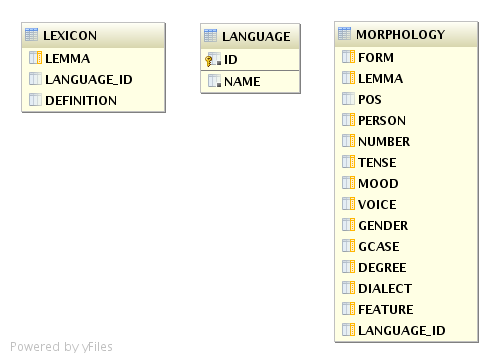

# TODO

- consider adding constraints to columns (e.g. pos)
- consider adding FK constraints between tables
- add build hook to create DB from SQL scripts

# Schema ARS

    ARS.language(
        id int PRIMARY KEY NOT NULL,
        name varchar(5) NOT NULL);

    ARS.morphology (
        form varchar(100),
        lemma varchar(100),
        pos varchar(100),
        person varchar(100),
        number varchar(100),
        tense varchar(100),
        mood varchar(100),
        voice varchar(100),
        gender varchar(100),
        gcase varchar(100),
        degree varchar(100),
        dialect varchar(100),
        feature varchar(100),
        language_id int);

    ARS.lexicon (
        lemma varchar(100),
        language_id int,
        definition varchar(255));

## Language

    | id | name  |
    +----+-------+
    | 2  |'greek'|
    | 3  |'latin'|

## Lexicon

### Lemma
Corresponds to `lemma` in table `morphology`.  The dictionary headword.

### lang_id
One of:

- 2 (Greek)
- 3 (Latin)

### definition
Contains a short definition of the word identified by `lemma`.

## Morphology Table

### FORM
The form of the word, e.g. capias

### LEMMA
The lemma to which the word form belongs, e.g. capio

### POS
The part of speech. One of:

    'numeral'
    'conj'
    'adj'
    'exclam'
    'pron'
    'adverbial'
    'irreg'
    'prep'
    'verb'
    'article'
    'partic'
    'noun'
    'part'
    'adv'

### PERSON
The person of a verb. One of:

    '2nd'
    ''
    '1st'
    '3rd'

### NUMBER

    'dual'
    ''
    'pl'
    'sg'

### TENSE

       'imperf'
       ''
       'perf'
       'futperf'
       'aor'
       'pres'
       'plup'
       'fut'

### MOOD

       ''
       'ind'
       'gerundive'
       'inf'
       'supine'
       'imperat'
       'opt'
       'subj'

### VOICE

       ''
       'mp'
       'mid'
       'act'
       'pass'

### GENDER

       ''
       'masc'
       'neut'
       'fem'

### GCASE

       'dat'
       ''
       'gen'
       'voc'
       'abl'
       'nom'
       'acc'

### DEGREE

    ''
    'comp'
    'superl'

### FEATURE
Some examples:

    ''
	'contr meta_to_peda'
	'unaugmented nu_movable causal'
	'contr desiderative'
	'syncope en_to_eni'
	'contr n_infix pres_redupl'
	'nu_movable elide_preverb causal pres_redupl'
	'contr unaugmented short_eis'
	'contr raw_preverb short_subj'
	'metath'

There are several hundreds of different values to this field.

### LANGUAGE_ID

    3 = 'latin'
    2 = 'greek'

### DIALECT

There are about a hundred distinct values, e.g.

	''
	'epic ionic poetic'
	'attic epic ionic'
	'epic doric ionic aeolic poetic'
	'attic poetic'
	'attic epic doric'
	'epic doric ionic aeolic parad_form'
	'attic epic doric ionic aeolic poetic'
	'homeric doric ionic aeolic poetic'

The unique dialects which may appear are:

- NULL
- aeolic
- attic
- doric
- epic
- homeric
- ionic
- parad_form
- poetic
- prose